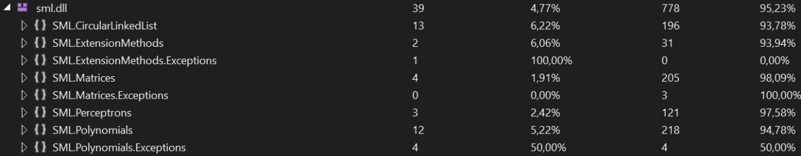

# SML

    

## Table of Contents

- [Description](#description)
- [Badges](#badges)
- [Contributing](#contributing)
- [License](#license)

### Description

SML - Small Math Library for .NET. I decided to create this library, because sometimes the functions I need are simply not available, and I do not know any popular mathematical extensions

## Badges

---

### Features
- [Circular Linked List](SML/SML/CircularLinkedList)
  - [Tests](SML/SML.Tests/CircularLinkedListTests)
- [Extension Methods](SML/SML/ExtensionMethods/ArrayExtension.cs)
  - [Tests](SML/SML.Tests/ExtensionMethodsTests/ArrayExtensionTests.cs)
- [Matrix](SML/SML/Matrix)
  - [Tests](SML/SML.Tests/MatrixTests.cs)
- [Perceptron](SML/SML/Perceptron/Perceptron.cs)
  - [Tests](SML/SML.Tests/PerceptronTests.cs)
- [Polynomials](SML/SML/Polynomial)
  - [Tests](SML/SML.Tests/PolynomialTests)

Code Coverage:

## Contributing

> To get started...

### Step 1

- 🍴 Fork this repo!

### Step 2

- **HACK AWAY!** 🔨🔨🔨

---

## License

- **[MIT license](http://opensource.org/licenses/mit-license.php)**
- Copyright 2022 © <a href="https://github.com/VsIG-official" target="_blank">VsIG</a>.
